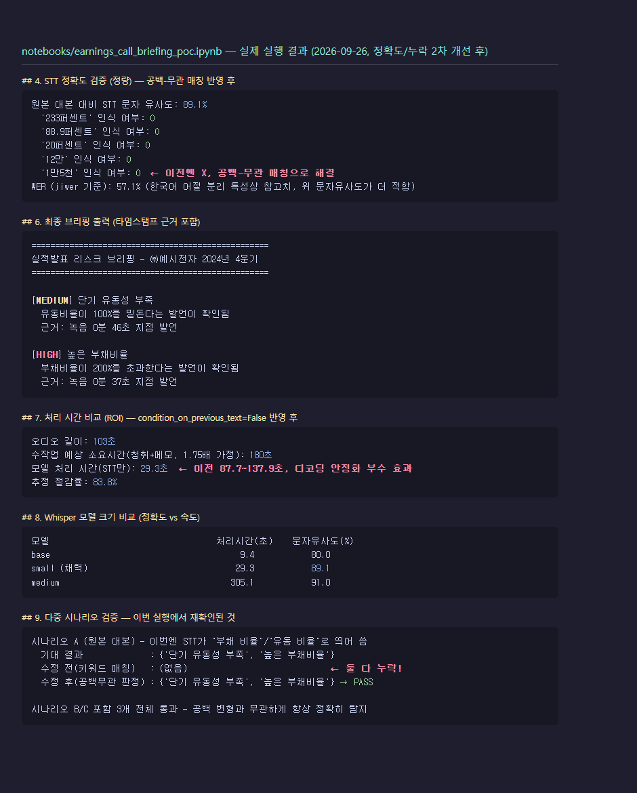

# 실적발표 음성 → AI 브리핑 PoC

[AI Business Briefing & Intelligence Publisher](https://github.com/rubilisa08/AI-project_MVP)의 확장 PoC입니다. 기존 프로젝트는 PDF/Excel/뉴스 URL만 다뤘는데, 이 PoC는 **실적발표(컨퍼런스콜) 음성**을 새로운 입력 채널로 추가해 STT(Whisper) → 리스크 브리핑까지 이어지는 흐름을 검증합니다.

- 문제 정의: [PROBLEM_DEFINITION.md](PROBLEM_DEFINITION.md)
- PoC 노트북 (실행 완료, 출력 포함): [notebooks/earnings_call_briefing_poc.ipynb](notebooks/earnings_call_briefing_poc.ipynb)
- 개선 효과 검증 결과 (실측치): [VALIDATION_RESULTS.md](VALIDATION_RESULTS.md)
- 업무 적용 지점 선정 과정 (후보 비교·회고): [APPLICATION_POINTS.md](APPLICATION_POINTS.md)

## 실행 방법 (Google Colab 권장)

1. 이 저장소를 GitHub에 올린 뒤, `notebooks/earnings_call_briefing_poc.ipynb`를 Colab에서 엽니다.
   - Colab 주소창에 직접 열기: `https://colab.research.google.com/github/rubilisa08/quest_PoC/blob/main/notebooks/earnings_call_briefing_poc.ipynb`
2. 위에서부터 순서대로 셀을 실행합니다. **GPU가 필요 없습니다** (Whisper `small` 모델은 CPU 런타임에서도 충분히 빠릅니다).
3. 5번 셀(`ANTHROPIC_API_KEY` 입력)에서:
   - Colab 좌측 "🔑 Secrets"에 `ANTHROPIC_API_KEY`를 등록해두면 자동으로 사용됩니다.
   - 키가 없으면 그냥 Enter를 누르세요 — 기존 프로젝트의 `MOCK_LLM` 방식과 동일하게 결정론적 목업 로직으로 자동 전환되어, 키 없이도 전체 파이프라인이 끝까지 실행됩니다.
4. 로컬(Jupyter)에서 돌리고 싶다면 `pip install openai-whisper gTTS anthropic jiwer`와 `ffmpeg` 설치가 필요합니다.
5. 8번 셀(모델 크기 비교)은 `medium` 모델(~1.5GB, CPU에서 8분+ 소요)을 추가로 돌립니다. 빠르게 훑어보고 싶다면 이 셀은 건너뛰어도 나머지 파이프라인엔 영향이 없습니다.

## 무엇을 검증하는가

1. **AI 모델 선정 및 실행**: OpenAI Whisper(STT)를 실제로 실행해 한국어 음성을 텍스트로 변환 (선정 이유는 노트북 3번 섹션, 실측 비교는 8번 섹션 참고)
2. **PoC 흐름**: 대본(텍스트) → gTTS(음성 합성) → Whisper(STT) → Claude(리스크 추출, 기존 프로젝트와 동일한 "원문 인용 기반" 설계 + 코드 레벨 grounding/스키마 검증) → 타임스탬프 근거가 붙은 브리핑
3. **개선 효과 검증**:
   - 정량: STT 문자 유사도·WER, 처리 시간 대 수작업 청취 예상 시간 비교, Whisper 모델 크기별 정확도-속도 트레이드오프
   - 정성: 기존 프로젝트가 Excel 경로로 찾아낸 리스크를 음성 경로로도 동일하게 찾아내는지, 그리고 재무 프로필이 다른 시나리오에서 오탐 없이 동작하는지(9번 섹션)

## 실행 결과 (실측, 2026-09-26 로컬 CPU 실행 — 정확도/누락 개선 2차 반영 후)

| 지표 | 결과 |
|---|---|
| STT 문자 유사도 | 89.1% (WER 57.1%, 한국어 어절 분리 특성상 참고치 — 자세한 설명은 VALIDATION_RESULTS.md) |
| 핵심 재무 숫자 인식 | **5개 중 5개** (이전엔 4/5 — 공백-무관 매칭으로 완전 해결) |
| Excel 경로 vs 음성 경로 리스크 탐지 일치 | ✅ 동일 (단기 유동성 부족, 높은 부채비율) |
| 처리 시간 절감률 | **83.8%** (이전 34~52% → Whisper 디코딩 안정화 부수 효과로 처리 시간 대폭 단축) |
| Whisper 모델 비교 | `small`(29.3초, 89.1%) vs `medium`(305.1초, 91.0%) |
| 다중 시나리오 검증 | 3개 시나리오 전체 통과 — 이번 실행에선 원본 시나리오조차 STT의 임의 띄어쓰기 때문에 "수정 전" 로직이 리스크를 하나도 못 찾았지만, "수정 후" 로직은 안정적으로 통과 |
| 전문용어 인식 개선 | "손익"·"총계" 오인식 해결 / "질의응답"·"매출채권" 등은 아직 남음 (정직하게 기록) |

**정확도·누락 문제에 실제로 반영한 개선**: Whisper `initial_prompt`로 회계 용어 사전 주입, 공백 유무와 무관하게 매칭하도록 일반화, `condition_on_previous_text=False`로 디코딩 반복-루프(검증 중 실제로 30분 타임아웃을 겪고 원인을 진단해 고침) 방지. 무엇이 좋아졌고 무엇이 그대로인지 과장 없이 [VALIDATION_RESULTS.md의 0번 섹션](VALIDATION_RESULTS.md)에 정리했습니다. 실행된 노트북 원본(모든 셀 출력 포함)은 [notebooks/earnings_call_briefing_poc.ipynb](notebooks/earnings_call_briefing_poc.ipynb)에서 그대로 볼 수 있습니다.

## 정확도·보안을 위해 넣은 코드 레벨 가드

- **Grounding 검증**: 리스크의 근거 타임스탬프가 실제 세그먼트와 일치하는지 코드로 재검증 (할루시네이션 가드)
- **스키마 검증**: 필수 필드/허용값 누락 시 즉시 실패 처리
- **프롬프트 인젝션 방어**: 세그먼트 텍스트 속 지시문을 명령으로 따르지 않도록 시스템 프롬프트에 명시
- **API 실패 폴백**: Claude 호출 실패 시에도 파이프라인이 죽지 않고 목업으로 안전하게 대체
- **디코딩 안정성**: `condition_on_previous_text=False`로 Whisper의 반복 루프(hallucination loop)를 방지 — 검증 중 실제로 겪은 30분 타임아웃 문제의 해결책
- **임계값 인자화**: 리스크 판정 임계값(부채비율/유동비율)을 코드에 박지 않고 함수 인자로 분리
- **재실행해도 안 덮어쓰는 아카이빙**: 실행마다 `notebooks/runs/<RUN_ID>/`에 음성·STT 결과·리스크 판정을 보존
- **비밀정보 관리**: API 키는 Colab Secrets/환경변수로만 받고 코드·출력·git 이력에 남기지 않음

## 왜 AI-project_MVP와 같은 재무 숫자를 쓰는가

`sample_data/financial_sample.xlsx`(부채비율 233%, 유동비율 88.9%)와 동일한 숫자로 가상 실적발표 대본을 작성했습니다. 이렇게 하면 "같은 재무 데이터를 텍스트 경로(Excel)로 넣었을 때와 음성 경로(STT)로 넣었을 때 같은 리스크가 나오는가"를 직접 비교할 수 있어, 이번 확장이 기존 파이프라인과 일관된 결과를 내는지 검증하기 좋습니다.

## 한계

- 가상의 회사(㈜예시전자)와 TTS로 합성한 음성을 사용합니다 — 실제 기업 데이터/녹음이 아닙니다(저작권·기밀 문제 회피 목적).
- 실제 컨퍼런스콜의 배경 소음, 다수 화자, 전문용어 발음 환경은 반영되지 않았습니다.
- 화자 분리(Diarization)는 이번 PoC 범위 밖입니다.
